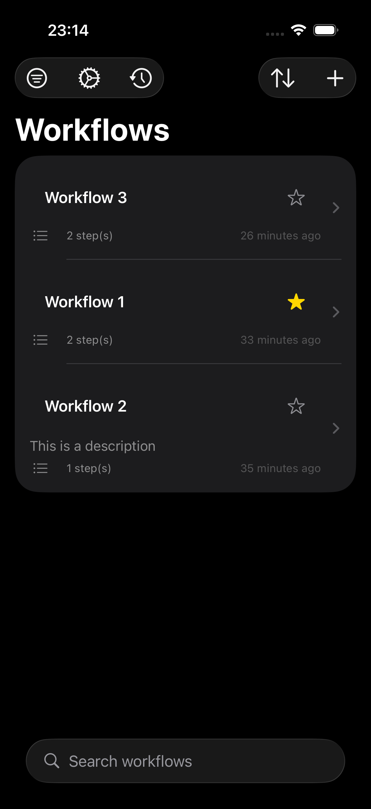
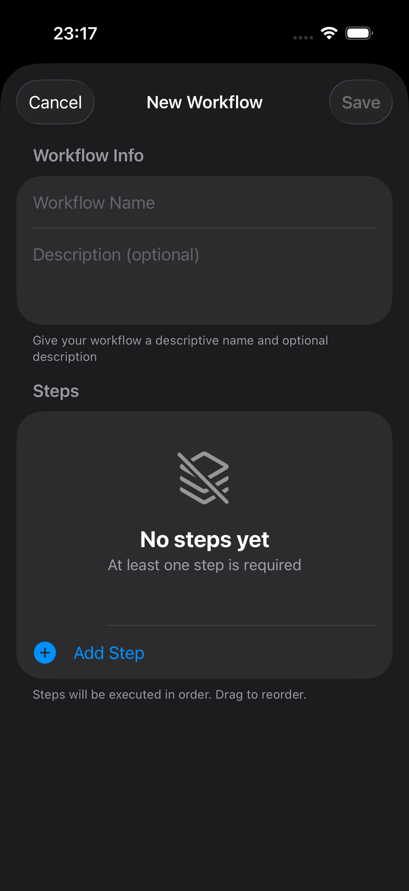
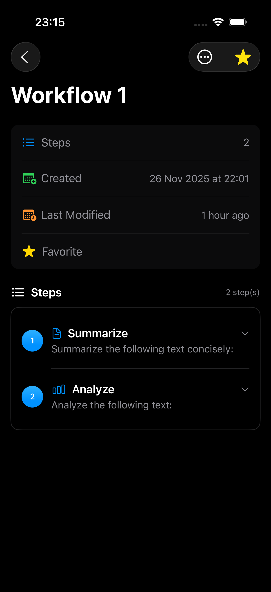
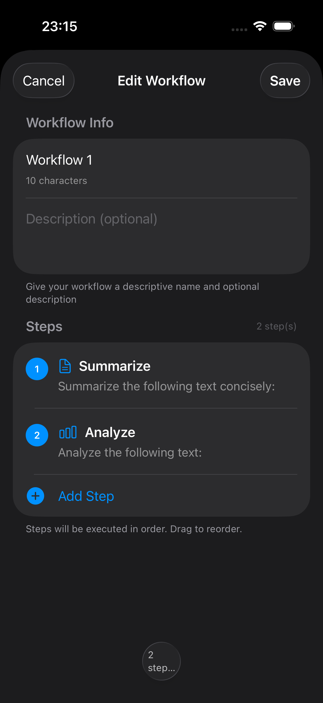
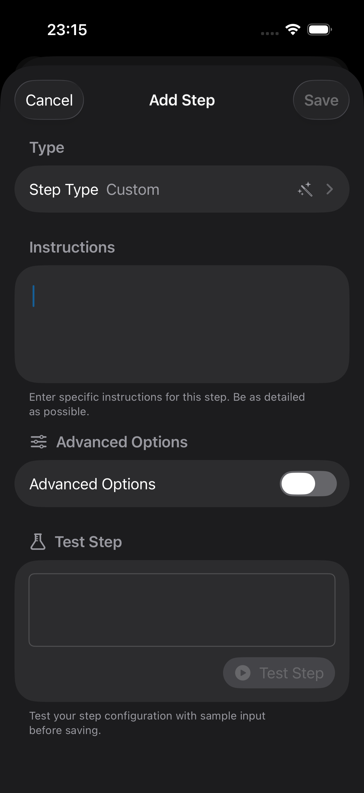
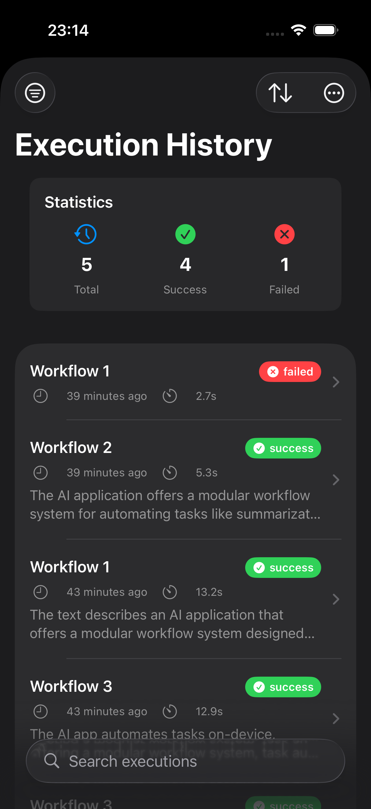
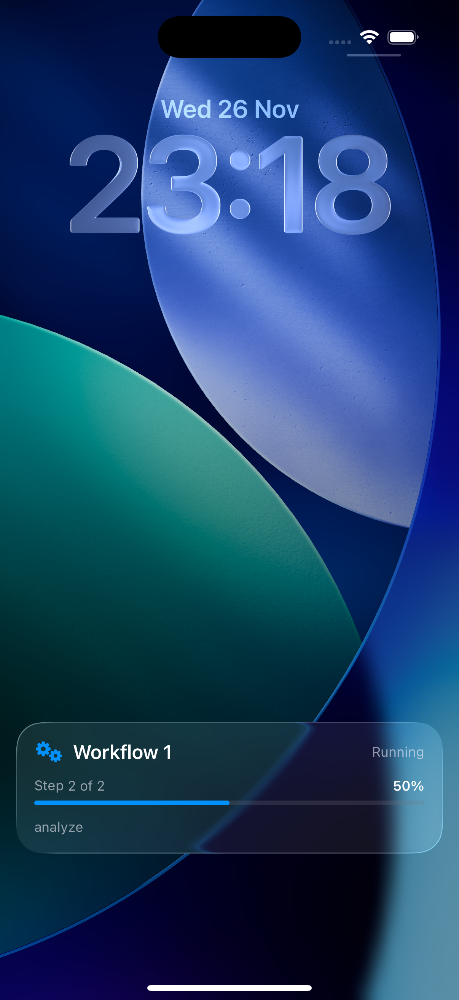
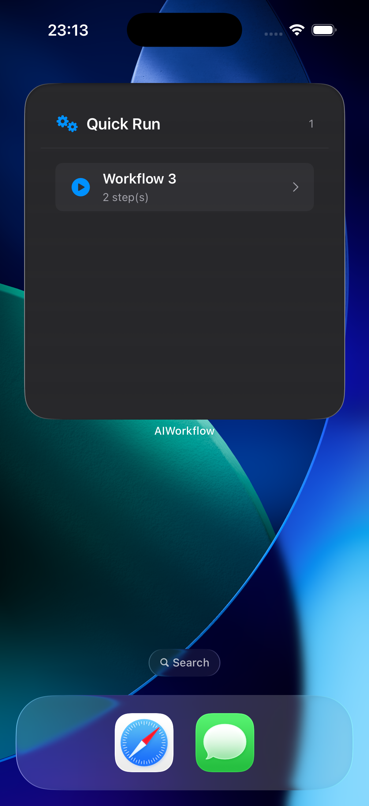
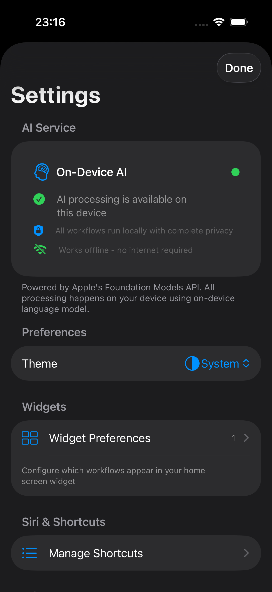

# AIWorkflow – Fully On-Device AI Automation Engine

[](https://developer.apple.com/ios/)
[](https://swift.org)
[](#)
[](#)

**Create and run multi-step AI workflows entirely on your iPhone — no internet, no data leaves your device.**  

Powered by Apple’s **Foundation Models API** (on-device LLM) • iOS 26+ required

---

## Project Structure

```
AIWorkflow
 ├─ App
 ├─ Data
 │  ├─ Engines
 │  ├─ Intents
 │  ├─ Repositories
 │  └─ Services
 ├─ Domain
 │  ├─ Components
 │  ├─ Helpers
 │  ├─ Models
 │  └─ Protocols
 └─ Presentation
    ├─ Execution History
    ├─ Settings
    ├─ Step Configuration
    ├─ Workflow Creation
    ├─ Workflow Detail
    ├─ Workflow Execution
    └─ Workflow List
       ├─ View
       └─ ViewModel
```

---

## Features

| Feature                        | Description                                                                      |
|--------------------------------|--------------------------------------------------------------------------------|
| Chain AI Steps                 | Summarize → Translate → Extract → Rewrite → Custom prompts                      |
| Siri Voice Control             | “Hey Siri, run a workflow in AIWorkflow”                                        |
| Live Activities                | Real-time progress in Dynamic Island & Lock Screen                              |
| Home Screen Widgets            | Up to 4 favorite workflows instantly accessible from your Home Screen           |
| Full SwiftUI + MVVM            | Clean, testable, SOLID-compliant architecture                                   |
| SwiftData + Swift Concurrency  | Modern persistence & fully async execution engine                               |
| Swift Testing                  | Applied Unit Tests                                                              |
| Localization                   | Fully localized in **English** and **Turkish**                                  |
| Themes                         | Supports **Light**, **Dark**, and **System** themes automatically               |

---

## Screenshots

<div align="center">
  
  
  
  
</div>

<div align="center">
  
  
  
  
</div>

<div align="center">
  
</div>

---

## Demo Video


---

## Tech Stack

- Swift 5+
- SwiftUI
- MVVM + Protocol-Oriented Programming
- Foundation Models API (Apple Intelligence on-device LLM)
- App Intents (Siri & Shortcuts)
- ActivityKit
- WidgetKit
- SwiftData
- Swift Testing

---

## Requirements

- **iOS Version**: iOS 26.0 or later  
- **Hardware (for full AI features)**: iPhone with A17 Pro chip or later  
- **Apple Intelligence**: Enabled in Settings → Apple Intelligence & Siri

> Older devices can install the app but will show “AI not available” in Settings with orange circle

---

## Why This Project?

This is my flagship portfolio project showcasing:  
- Real-world production use of Apple’s newest on-device AI technologies  
- Clean, maintainable, and tested iOS architecture  

---

## Contributing

Contributions are welcome. Recommended workflow:

1. Fork the repository
2. Create a feature branch  
   ```bash
   git checkout -b feature/your-feature
   ```
3. Make small, focused commits
4. Add or update tests where applicable
5. Open a Pull Request with change description and motivation
6. Link related issues when opening the PR

**Guidelines**:  
- Follow existing code style (Swift + SwiftLint conventions)  
- Prefer small, reviewable PRs  
- Include screenshots or GIFs for UI changes  
- For non-trivial changes, open an issue first to discuss design/approach

---

## License

This project is licensed under the **MIT License**.  
You are free to use, modify, and distribute the code, including for commercial purposes, as long as the original copyright notice is preserved.  

See the full license text in the `LICENSE` file.

© 2025 Okan Orkun
